# Go Program Verification Survey

## Problem Statement

The Go programming language has gained widespread popularity due to its robust support for concurrency, allowing developers to create scalable and efficient applications. However, the same concurrency features that make Go powerful can lead to subtle and complex bugs that are difficult to detect with traditional verification methods. These concurrency-related issues can cause unexpected behavior, data races, and system crashes, which pose significant risks to software reliability and safety. Given the critical role of concurrency in Go programs, there is a need for effective verification tools to ensure the correctness and robustness of Go code. The project conducts a literature review on recent go program verification tools, especially focusing on the concurrency side of the language, aiming to explore various existing solutions, analyze current limitations, and propose future directions.

## Project Design

1. Explore current existing verification tools for Go programs, find the most recent and SOTA ones for further analysis.
2. Construct Benchmarking test codes and test the chosen tools's performance on this test set.
3. Analyze the result and identify limitations of each.

## Research Methodology

**Data Collection**: Gathered information from a variety of sources, including academic papers, tool documentation, and official Go resources.

**Tool Evaluation**: Evaluated the selected verification tools based on the compiled benchmark test set that contains synthetic buggy programs covering most concurrency primitives in Go.

**Analysis on result**: Create visualize of testing results. Highlighted common trends and difference between various tools. Produce final analysis on current limitation as well as possible future directions.

## Report

[Link to final report](https://drive.google.com/file/d/1s9EwFdTi4Ei-Wyz3sFiAfQKNJMud1fR7/view?usp=sharing)

## Slides & Video

[Link to final presentation slides](https://docs.google.com/presentation/d/1sk0kwad6LC25e0SmVphqnju-OzF8olPDrRY_9kQW-4Q/edit?usp=sharing)
[Link to final presentation video](https://drive.google.com/file/d/1Xecj6IaEv-FjXSxOVF7ufmGWuac3ZwS4/view?usp=sharing)

## Go verification tool benchmark set

This project is adapted from [benchmark-maker](https://github.com/nicolasdilley/benchmark-maker)

This is a tool which synthesize Go programs from three sets of code
elements and verify the resulting set with three different static checkers
Gomela, GCatch and Godel2. These programs are made from instantiating
contexts, programs with holes, with 3 different code elements:

1.  The declaration of a concurrency primitive (such as a channel, waitgroup or mutex)
2.  A code snippet that contains a bug related to concurrency primitive from 1.
3.  A potential bound.

### Installation

Mac Sillicon likely does not work, Linux system is prefered for reproducing the result.

To build the tool the Go ecosystem is required, also need to build and configure verification tools Godel2, GCatch, and Gomela.

To install Go, follow the instructions [here](https://go.dev/doc/install).

To install Godel2, follow instructions [here](https://github.com/jujuyuki/godel2).

To install Gomela, follow instructions [here](https://github.com/nicolasdilley/Gomela).

To install GCatch, follow instructions [here](https://github.com/system-pclub/GCatch/tree/master/GCatch).

If you already have everything installed, simply clone this repo.

`git clone https://github.com/nicolasdilley/benchmark-maker`

and build the tool.

`go get && go build`

### Usage

To synthesize programs, Benchmark Maker requires two folders which contain two
different code elements, the first containing the contexts and the second
which contains the code snippets. The repo contains example snippets and contexts you can direcly use.

example code snippets

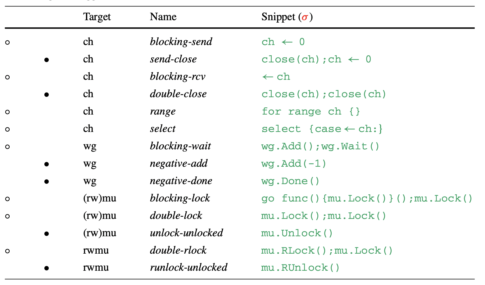

example context code

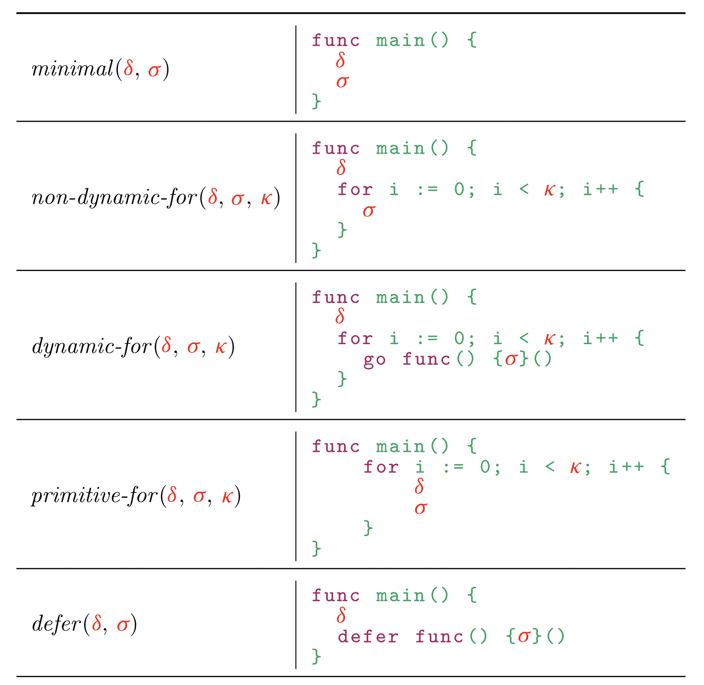
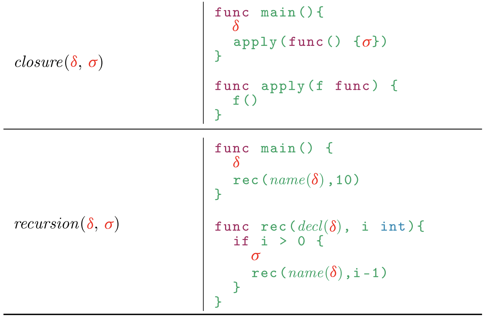
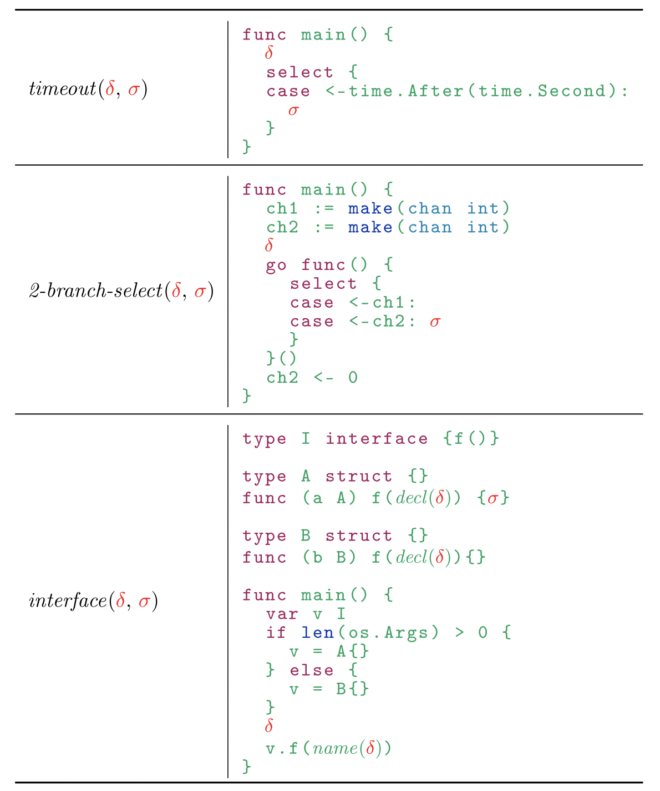
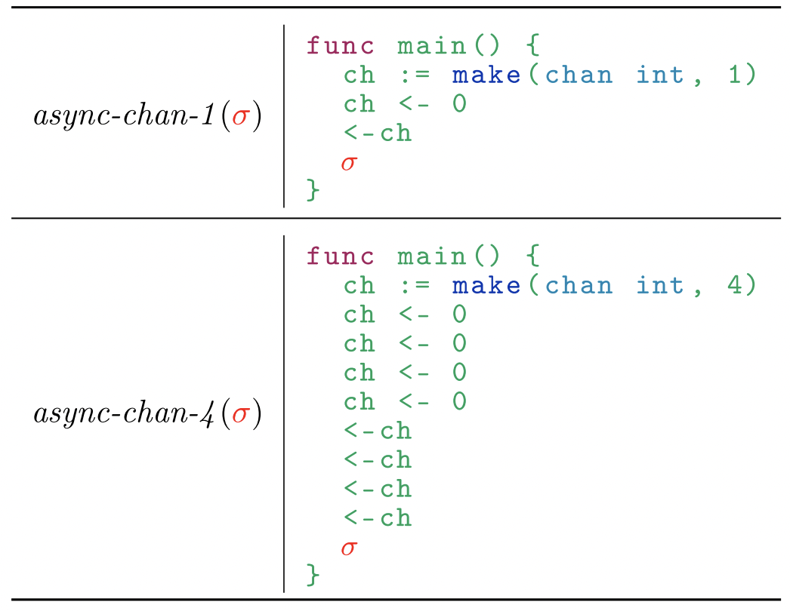

#### Contexts

A context is a program which contains holes for the declaration of concurrency
primitives (CP) , code snippets (CS) and a potential bound (bound).

The contexts can declare what type of concurrency primitive they allow by
specifying as a comment declared a the top of the context:

1. `// type = ALL` If they allow all concurrency primitives (channel, mutex and waitgroups)
2. `// type = CH` If they only allow channels.

The value given to the bound in the program is also given as a comment as
follow:

`// bounds = 10 000 ,len(os.Args)` which will instantiate
programs with bounds of `10 000` and `len(os.Args)`for example.

A set of contexts can be found in the `contexts` folder.

#### Code snippets

The only two requirements for code snippets are to declared which concurrency
primitive they use and to use specific names for the variables of the
concurrency primitives. This is achieved by commenting at the top:

1. `// type = CH` for channels snippets. The channel is available via the variable `ch`.
2. `// type = MU` for sync.Mutex snippets. The mutex variable is `mu`.
3. `// type = RWMU` for sync.RWMutex snippets. The rwmutex variable is `mu`.
4. `// type = WG` for sync.Waitgroup snippets. The waitgroup variable is `wg`.

note: Godel2 and GCatch does not support Waitgroup yet...

#### Generating and verifying a set of synthetic programs

The tool expects as argument the folder containing the contexts followed by
the folder containing the code snippets.

To instantiate and verify the contexts in `contexts` with
the code snippets in `snippets`, run:

`./benchmark-maker contexts snippets`

The console will output the result of verifying each code snippets into all
contexts with each tool (given as a list `verifiers` in `verify.go`).
The output can also be found in `text.log`.

The output for each code snippets is formatted as follow. The first column
shows the name of the contexts and the bound used. The rest of the columns
show the results and the time taken by each tool in the order they were given
in the list `verifiers` in `verify.go`.

The verification results are:

1. `\cmark` for a bug was found.
2. `\xmark` for no bug reported.
3. `\crash` which reports that the tool crashed.
4. `\nosupport` which reports that the tool reported that it did not support the benchmark.

### Results

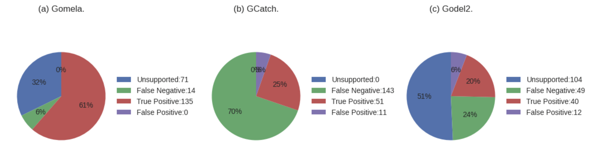

Detailed test results

No-op (no bug) programs

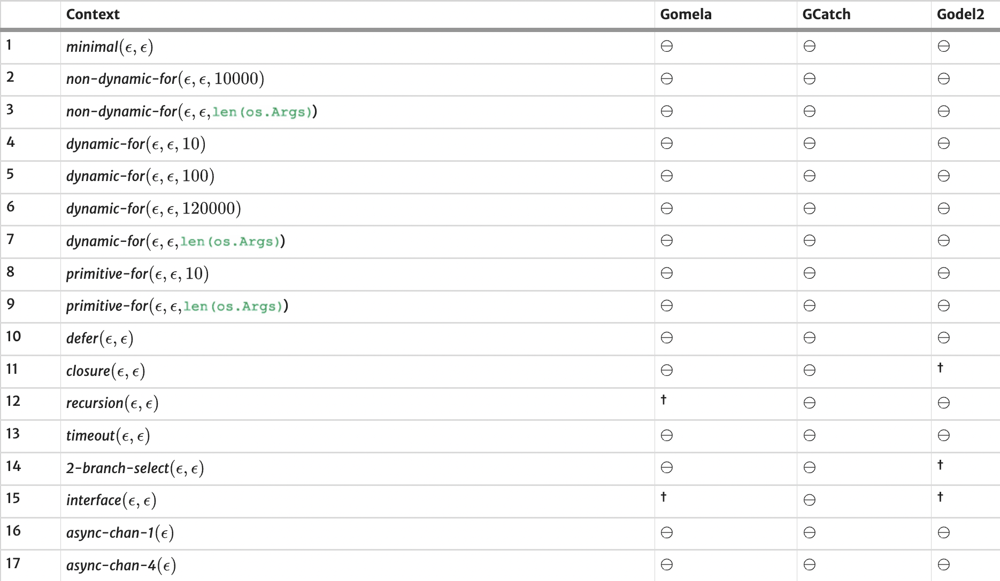

- dagger symbol mean not support, circle means true negative

Results for blocking channel bugs

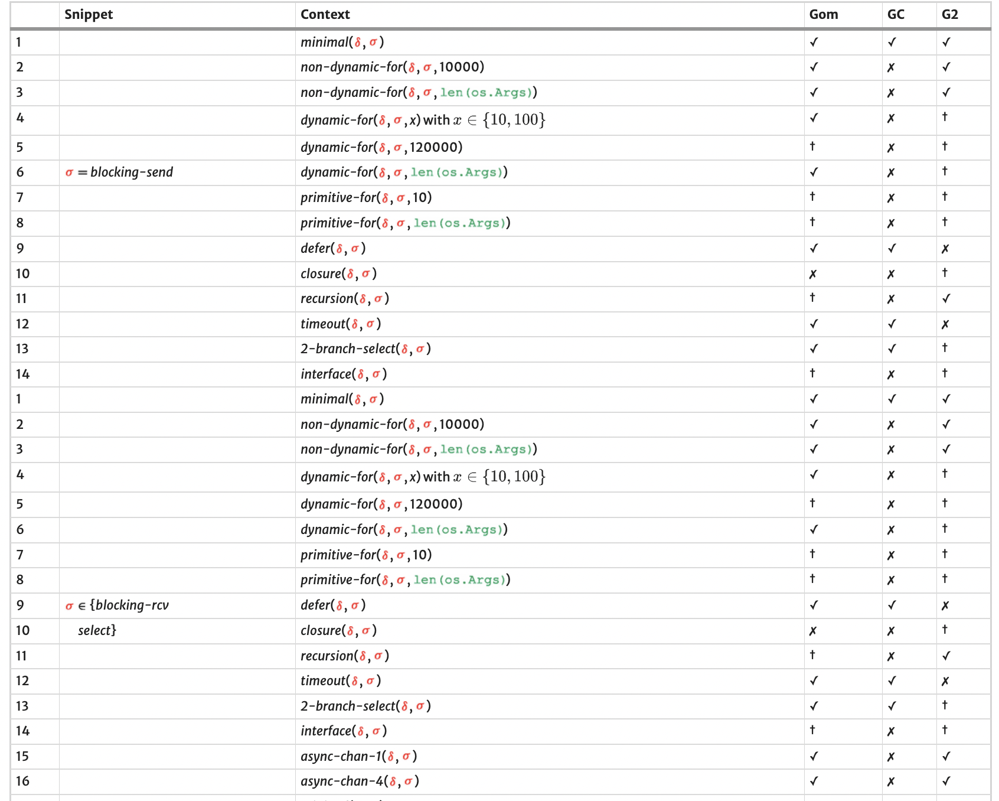
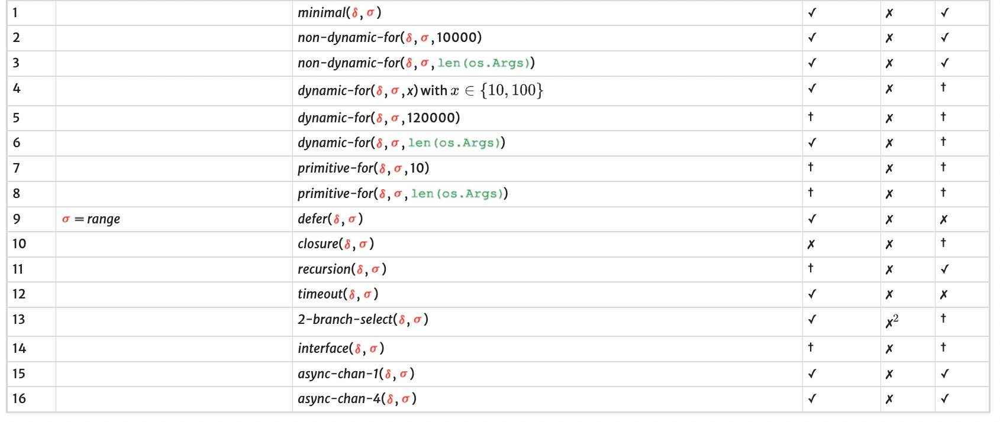

- dagger symbol means not support, check means true positive, cross means false negative

Results for channel safety errors

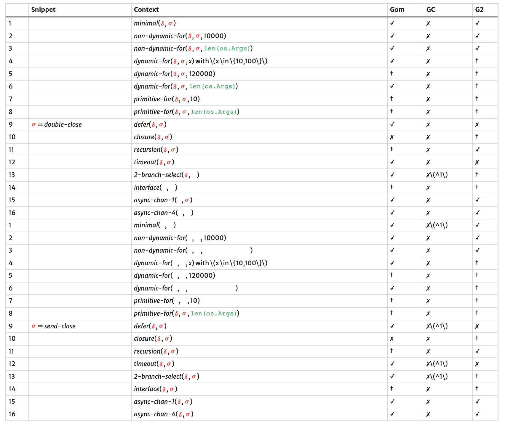

- dagger symbol mean not support, check true positive, cross false negative

Results for mutexes errors

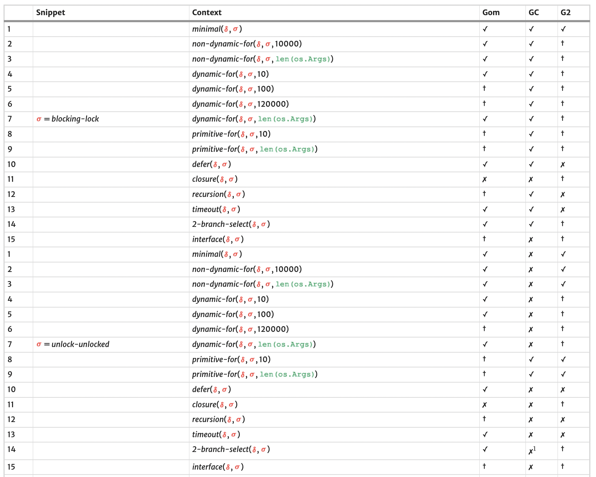
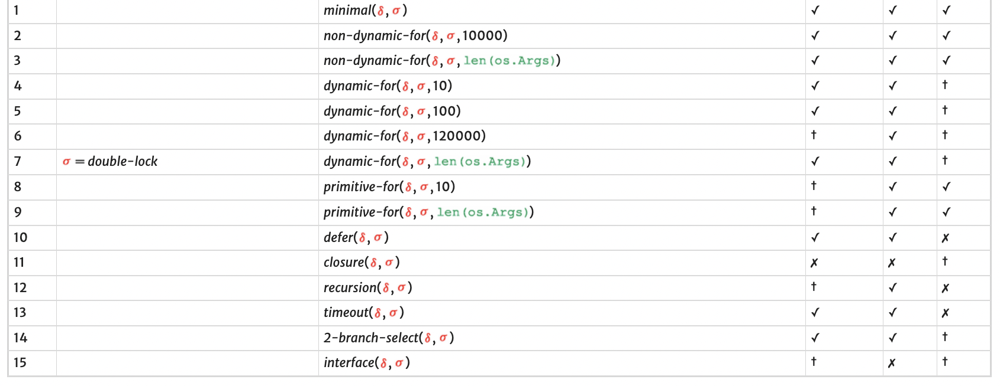

- dagger symbol means not support, check means true positive, cross means false negative

Results for RWMutex safety errors

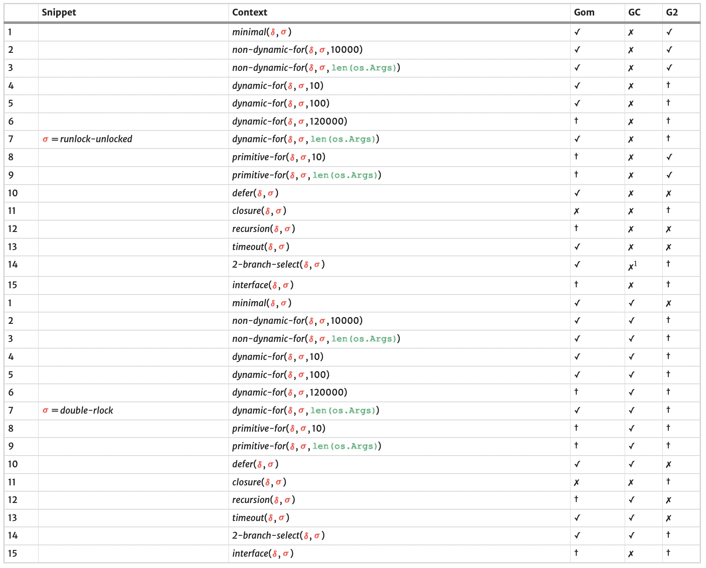

- dagger symbol means not support, check means true positive, cross means false negative

Results for Waitgroup errors

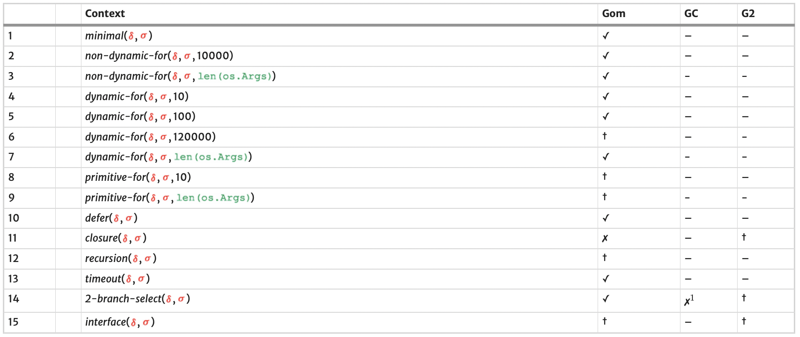

- dagger symbol means not support, check means true positive, cross means false negative, dash means not tested since not supported

